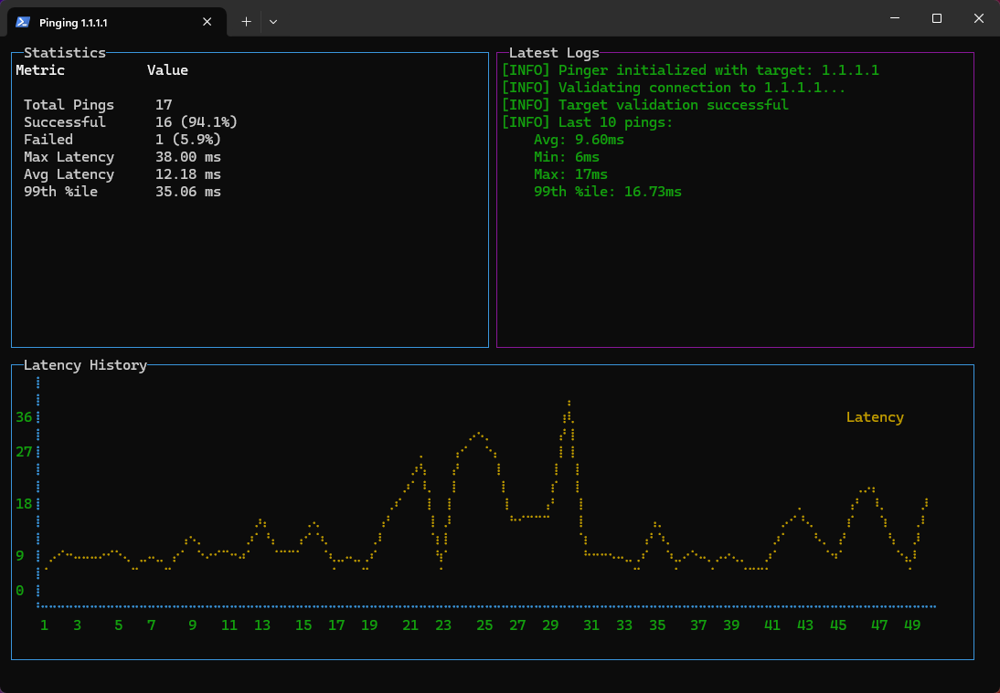

# Network Ping Monitor

A real-time network latency monitoring tool with a terminal-based UI built with TypeScript and Bun.



## Features

- Real-time ping monitoring with visual graphs
- Terminal-based user interface with blessed
- SQLite-based persistence for historical data
- Cross-platform support (Windows, Linux, MacOS)
- Live statistics including:
  - Success/failure rates
  - Average latency
  - 99th percentile latency
  - Maximum latency
- Rolling 50-point latency history graph
- Automatic log management
- Target host persistence

## Prerequisites

- [Bun](https://bun.sh) runtime installed
- [Node.js](https://nodejs.org) installed
- [Python](https://www.python.org) installed

## Installation

```bash
# Clone the repository
git clone https://github.com/lerndmina/pinger

# Navigate to project directory
cd network-ping-monitor

# Install dependencies
bun install